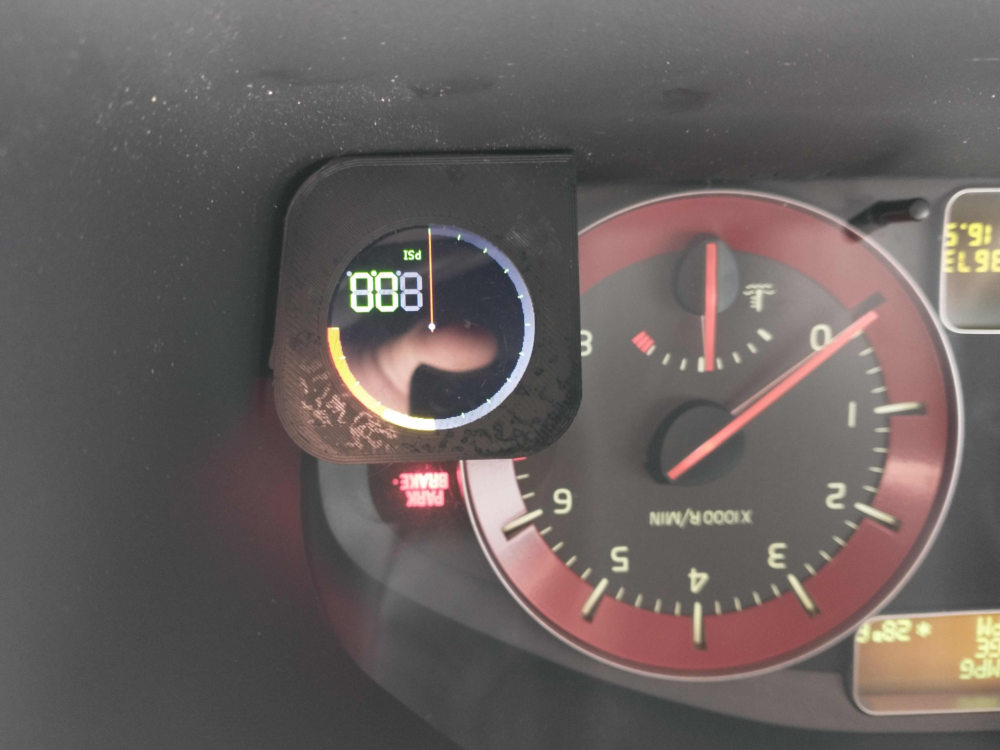
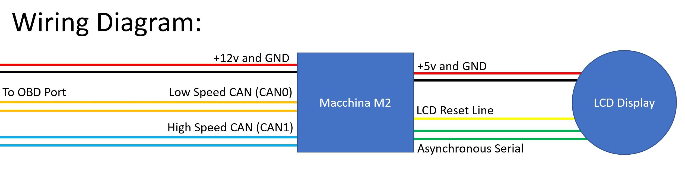
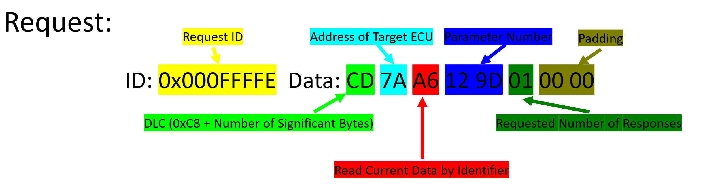
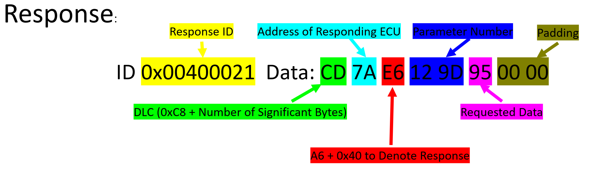
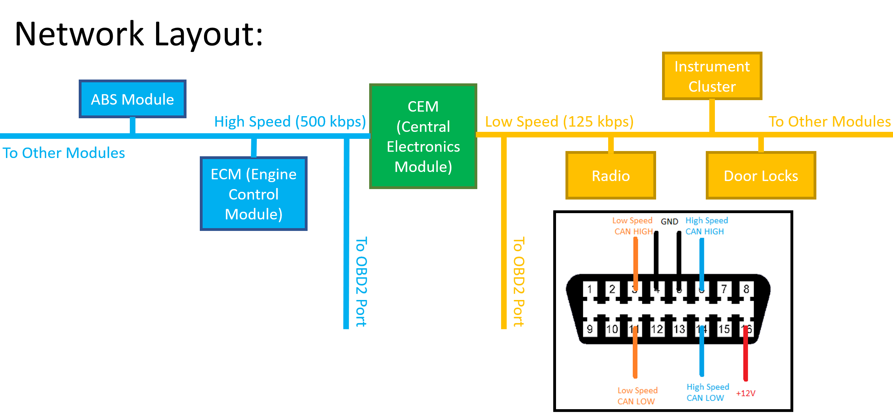
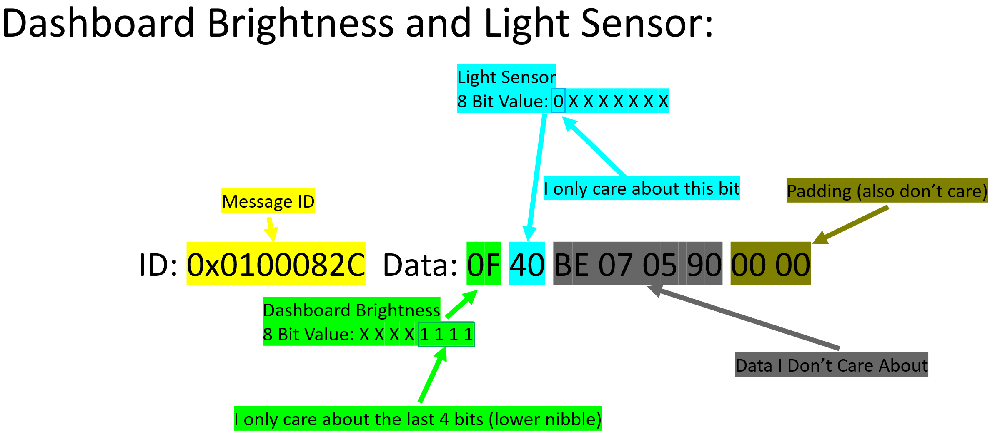
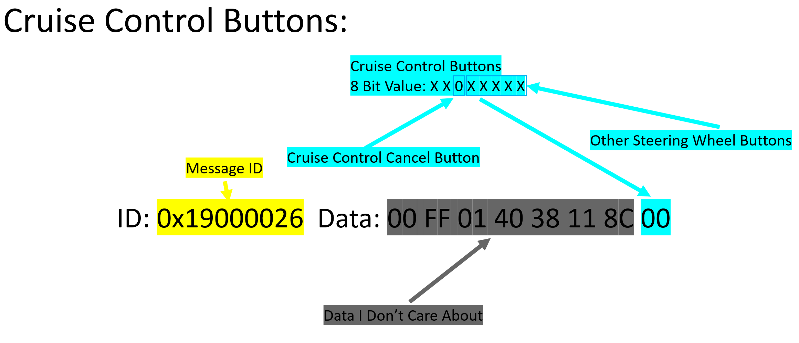
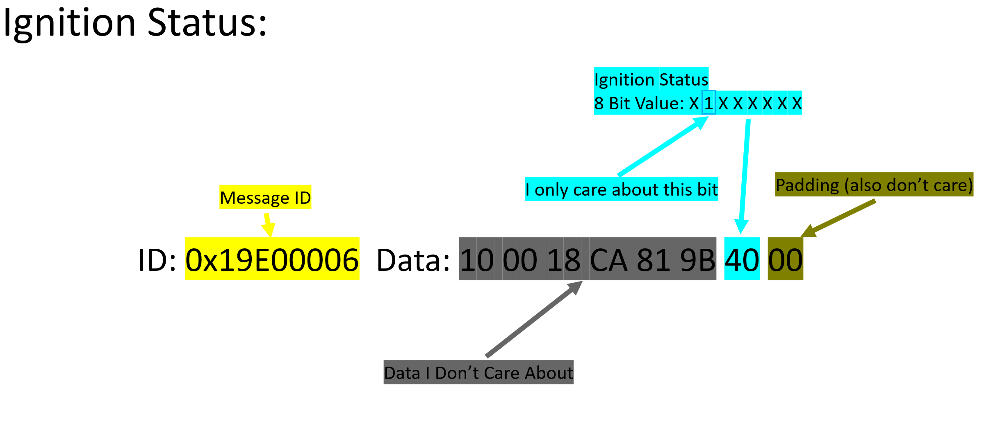

# Volvo-CAN-Gauge
Reverse engineering the Volvo VIDA protocol to gather diagnostic information not available via OBD2 on Volvo cars.

[https://www.youtube.com/watch?v=hdAKEG6ggRk](https://youtu.be/kRip9_HPZf4)
  

# Hardware:
- 2011 Volvo C30 T5
- 4D Systems ULCD-220RD round LCD Display (https://4dsystems.com.au/ulcd-220rd)
- Macchina M2 UTH (https://www.macchina.cc/catalog/m2-boards/m2-under-hood)
- Custom designed 3d-printed LCD mount designed to fit the shape of the bottom left corner of the dashboard bezel. (STL is in the Display Mount folder)

# Libraries:
- geneArduino: Used to send data to the 4D Systems display.
- due_can: Used to easily access the built in CAN interfaces on the Arduino Due (https://github.com/collin80/due_can)

# Basic Functional Description:

The Volvo VIDA protocol is a diagnostic protocol similar to UDS. However, unlike UDS the VIDA protocol, the first byte is a DLC and the second byte is the ECU address. An example (reading boost pressure) can be found below:

Other commands for byte 3 can be found in this paper: https://hiltontuning.com/wp-content/uploads/2014/09/VolcanoResearchPaperWeb.pdf

# Car Specific Details

This Volvo uses 29-bit IDs on both high (500kbps) and low (125kbps) speed CAN busses. Every frame from every ECU is 8 bytes long. There is no gateway and both busses are pinned out at the OBD2 connector, which makes it extremely easy to interface with the vehicle's onboard systems. A Pinout is shown below:

In this project, we are only concerned with recieving data that would be otherwise unavailable with OBD2. Boost pressure, for example, is not available via OBD2 on Volvo cars and if it was, it definitely would've made this project a lot simpler. (a partial list of discovered codes that you can request from ECU 7A from the VIDA database files is in Codes.txt)

We also use data from some broadcasted CAN frames that are used elsewhere in the car (for dashboard brightness, ignition status, the status of the light sensor on the dashboard and the buttons on the steering wheel). Ideally, we would capture ALL of our information from broadcast frames as that involves a lot less overhead and traffic on the bus. However, some of the information that we need never gets broadcast, so we sometimes have no choice.

The code uses a psudo multi-tasking approach where the message recieve loop is always running if one of the other loops isn't currently running. This allows us to update/check broadcast frames in the background for brightness changes, ignition status changes and button presses and update the global variables accordingly to be used elsewhere in the code.

In the display loop, we can show boost pressure, coolant temperature, intake temperature and ignition advance:

We react to the dashboard brightness broadcast frame so the display updates it's brightness along with the rest of the dashboard when the headlights are on. If the headlights are off, the display brightness is at maximum unless the brightness control is at it's minumum value as a way to shut the display off if required.

For right now, the only button we track is the cruise control cancel button. Holding the button for more than 2 seconds changes the currently displayed page. Perhaps in the future, a menu system could be implemented.

In order to turn the display on and off with the ignition, we look at the ignition status frame:

In order for the gauge to feel more "analog" the needle and value of the gauge will not change between distant values instantaneously. There is a built in loop that will require the needle to go through all intermediate values if the variable changes by more than 1.

# Notes:

- Compatibility with other vehicles is unknown at this point. Most likely, any other cars using the Volvo Bosch ME9 implementation will work with no modifications (although I have heard some reports that the broadcast IDs change from vehicle to vehicle, so that may need to be tweaked)
- Volvo uses extended IDs for their CAN frames. I am not 100% sure why they do this yet.
- Volvos of this vintage have 2 CAN networks, a High Speed bus at 500kbps and a Low Speed bus at 125kbps. The high speed bus is connected to the ECU, steering modules, braking and other modules. The low speed bus is connected to the radio, door modules, instrument cluster and other associated accessories. The CEM (Central Electronics Module) acts as a gateway between the high and low speed busses. This project connects to both the high and low speed busses.
- Older vehicles have a diagnostic relay that needs to be activated via K-line in order to access the CAN buses via the OBD2 port. Because mine does not require this, I don't have much information about it.

# Other Resources:
- http://hackingvolvo.blogspot.com/
- https://github.com/hackingvolvo
- http://opengarages.org/handbook/ebook/
